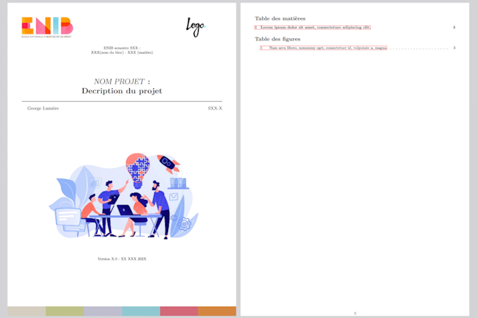

# mpek29-latex-template

## 🚀 Overview

A beautiful, simple, and clean LaTeX template designed for ENIB students who want to write project reports. If you like the template, feel free to give it a star!

## 🎯 Purpose
- ✍️ **Streamlined Reporting**: Facilitate the creation of professional-looking project reports.
- 🎓 **Student Resource**: Tailored specifically for ENIB students' needs.
- 🛠️ **Open Source Development**: Encourage collaboration and customization from users.

## 📝 Getting Started
To use this template, I recommend following [this tutorial](https://florianpasco.com/learning/innovation/use_template_sharelatex/). 

After that, simply write your LaTeX code in the `body.tex` file.

## 🌟 License
The theme is available as open source under the terms of the [GNU General Public License v3.0](https://github.com/mpek29/mpek29-latex-template/blob/master/LICENSE). Feel free to use, modify, and contribute! 🚀
